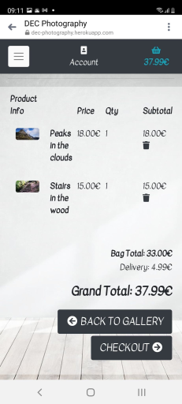

# DEC Photography

Live link here --> [DEC Photography](https://dec-photography.herokuapp.com/)

 E-commerce website build to showcase photos made by group of travel photographers and give users an option to 
buy a print copy of a photo for decoration purposes, gifts etc., and to support the photographers in 
their future endeavours. 

## UX

### User Stories

#### Visitor/Shopper

1. As a first time visitor I want to visit a website where I can see photos that I can purchase.
2. As a visitor I want to be able to see a single photo with an option for full-screen view. 
3. As a shopper I want to be able to see price for every photo and a total for my purchases at 
any time so I can menage the amount I want to spend.
4. As a shopper I want to be able to select quantity of particular item so I can add more then one to my 
shopping basket.
5. As a shopper I want to be able to remove items from my shopping basket so I can reduce the 
cost of my purchase.
6. As a shopper I want to be able to make secure transactions and to feel safe that my personal
data is handled securely.
7. As a shopper I want to be able to see conformation for my order after checking out so I know 
that everything was done correct.
8. As a shopper I want to be able to receive an email conformation so I can keep the details 
of my purchase.
9. As a user I want to be able to register so that I have my own account and can track my 
orders from the website.
10. As a user I want to be able to read more about the authors/photographers so that I can understand their 
motivation and inspiration.
11. As a user I want to be able to contact the photographers so that if I have I can send personal requests or 
ask additional questions.

#### Owner

12. As an Owner I want to be able to add a photo so that I can increase/renew the content of items on the site.
13. As an Owner I want to be able to edit an item so that I can change description or price of a photo.
14. As an Owner I want to be able to delete an item so that I can maintain the website actual and avoid keeping item for very long.

### Design 

* Color Scheme 
   * The navigation menu, buttons, text and some cards backgrounds use the Bootstrap's class "dark" (black-blue color). 
   * White backgrounds are used throughout the project. It's basic choice when showing photos so that all other colors can pop out.
   * Bootstrap's class "light" and color #fafafa (in css files) are used for text color on dark backgrounds.    

* Typography 
   * Font Kaushan Script is used for headers/titles throughout the project. 
   * Font Kavivanar is used for the remaining text content in the project. 
   * Sans Serif is used as the fallback font in case the other fonts aren't being imported into the site correctly.

## Features

### User/Shopper

* Responsive Design

* User Friendly Layout

* Internal and external navigational links and buttons

* User Authentication 

* Receiving/Sending Emails (Confirmations, Orders etc.)

* Products/Items to View 

* Purchasing Items

* Secure payment system 
   * **Test transaction info:**

        credit card: 4242 4242 4242 4242

        expiration date: 04 / 24

        CVC: 424

        ZIP: 42424

* Reading content

* Contact Form 

### Owner

* Add Products

* Edit Products

* Delete Products

## Technologies Used

### Main

1. HTML5
   * Used to add structure to the website.
2. CSS3
   * Used to add style to the website.
3. JavaScript
   * Used to add logic and interactive features.
4. Python
   * Used to add backend structure and logic to the project.
5. Django Frameworks
   * Used to add Python code packages.  

### Additional

1. Git
   * Used for version control.
2. GitHub
   * Used to create a repository where after being pushed from Git the project is stored.
3. Bootstrap
   * Used for styling and add responsive design features to the project.
4. jQuery
   * Used to add frontend interactivity.
5. Google Fonts
   * Used to add fonts to the project's text content.
6. Font Awesome
   * Used to add icons to the project for better UX.
7. [Favicon.io](https://favicon.io/)
   * Favicon generator used to add icon to the browser tab.
8. Reduce Images (https://www.reduceimages.com/)
   * Used to reduce the size of images and photos in the project. 
9. Stripe
   * Used to add and test payment system in the project.
10. Heroku
    * The platform where the website is deployed.
11. Amazon Web Services (AWS)
    * Used to host the static and media files for the project.
12. [Grammar Check](https://www.grammarcheck.net/editor/)
    * Used to check spelling and grammar to README.md file.

## Testing 

### Testing User Stories

#### User/Shopper

* First user story is completed by opening the home page that gives clear understanding of what the website is about and 
large call to action button that lead the user to his search. Then by opening a photo detail page the user can click a "Add 
to Basket" button and checkout to complete the purchase.

* Second user story is completed by providing the user with a "View Photo" button in the Gallery page where a single photo 
detail page is showing and there is an info hint that leads the user to viewing the photo in full screen size in a new window.

* Third user story is completed by providing the user with a price tag bellow every photo in the gallery page and again bellow 
the photo in the detail page for every gallery item. The second part of this user story is completed by showing all the time the 
total amount of his basket in the upper right corner of the screen.

* Fourth user story is completed by providing the user with option to change the quantity of how many of this particular item to 
be added to his shopping basket. The quantity selector is located under the name and price of the photos in their detail pages.

* Fifth user story is completed by providing the user with a trash can icon-button under the total price for every item in the shopping basket
and by clicking on it the user can remove a particular item from his basket. 

* The next user story is completed by providing the user with secure payment system from Stripe taking care of all sensitive data 
that is provided from the user.

* The next user story is completed by providing the user with a detailed order information page after checking out that also can be seen 
at any time in the user's profile on the website.

* The next user story is completed by sending an email confirmation for the order containing detailed information for the user's purchase, 
no matter if the user is signed up or does not have register user account.

* The next user story is completed by providing the user with an authentication system that give the user options to register/login/logout an 
account. See all purchases made in the order history section in the user's profile, and keeping delivery and contact information. 

* The next user story is completed by providing the user with an About page (link located in the navigation menu) which lead the user to more 
information about what are the main ideas of the website's owners.

* The next user story is completed by providing the user with a Contact page where a contact form is available for the user to send messages 
as well as additional contacts like direct email and a phone number. The contact form is functional and it sends the user messages to the 
Administrator.
   * The massages can be found on the Admin's page, in the "Contacts" section. All messages are stored there so the store owners can read them
    and reply. 

#### Owner

* These user stories are completed by providing the website's owners with CRUD functionality and the access to add/edit/delete actions are restricted 
only to users with a superuser status. 

### Links and Buttons

* Internal
   * All navigation links have been tested in development environment and in the live project 
   and no errors were found or shown in the console.
   * All buttons throughout the website have been tested in development environment and in the live project 
   and no errors were found or shown in the console.
* External 
   * All social media links have been tested in development environment and in the live project. All working 
   leading the user to the selected website's home page, because DEC Photography does not have any content elsewhere.

### Responsive Design

* The website is tested for responsive design in development stage with the developer tools in the browser and on all 
provided devices there. No issues were found on medium and larger screens and on mobile small screen devices. The 
minimum width tested without any issues is 320px.

* In production stage the website is tested on different mobile and desktop devices and no issues were found.

* Mobele devices used for testing in production stage:
   * Samsung Galaxy S20 FE
   * Huawei P20 Pro 
   * Samsung Galaxy A51
   * Xiomi Note 5

* Desktop devices used for tests in production stage:
   * Acer Aspire 5 A515-51G
   * Acer B7 series-B277(Monitor)
   * Lenovo ThinkPad 20Q6 

* Testing images from mobile device:

### Problems

* In development stage nearly from the beginning in the terminal when the port 8000 is active there was an error 404 showing 
about favicon.ico not found. I didn't use a favicon icon at this point but in attempt to fix it I added a favicon icon to the project 
but that didn't fix the problem. Sometimes it shows it in the terminal and because I had very limited time to develop the 
whole project, and the fact that it is not showing this error in production I decided to look further in solving this problem 
in the near future.

* In development stage after creating the firs Stripe webhook when an order is confirmed it was working the first times I tested it 
but then after adding the setting for the confirmation emails I started noticing error 400 from the webhook in the terminal saying 
"Bad Request: checkout/wh/". Again for the limited development time and after testing the webhook without any issues in production 
I decided to look further in solving this problem in the near future when I have time and better understanding of how this mistake was 
first made and how to fix it without causing any further problems in the code. 

## Deployment

Creating the repository for the project in GitHub

1. Go to GitHub and login an account.
2. From the profile page menu go to repositories and select the Create New Repository button.
3. Add template, name the repo, add description and select the repo to be Public and create it.
4. Once the repo is created select GitPod to start the development process and store everything in the project's 
repository. 

After completing the code writing, pushing to project's repository and finish testing in development environment, 
the following steps were taken to deploy the website to a cloud platform.

5. Create Heroku app for the project.
   * Go to Heroku.com and login an account.
   * Create new app, set name and nearest location and then click the create app button.
   * Once in the app, from the menu select Resources. Then in Add-ons write Postgres and from the choices shown 
    select Heroku Postgres and choose using a free plan.
6. In the GitPod workspace create a Procfile and all requirements that Heroku needs to connect with the GitHub repo.
   * Freeze the requirements in requirements.txt file, save and push everything to Heroku.  
7. In the Heroku app select Deploy from the menu and choose Connect to GitHub.
   * Write the GitHub repository name and when shown select it.
   * Activate the automatic deploys from the repo's master branch.
8. In the workspace remove secret keys from Settings in the projects main app and move them to the Heroku app for the project 
by adding them to Config Vars in the Settings menu.
   * Once that is done save and push from the GitPod workspace to Heroku.
   * In the Heroku app, in Activity menu can be followed the building process and check if everything is pushed correctly.
   * Live link to the website can be found in Domain section in the Settings menu.  
9. Create AWS profile, fill out all needed information and complete registration.
   * When the account is ready access the AWS management console and find S3 service and open it.
   * In the S3 service create a new bucket which will be used to store the static and media files for the website and acknowledge that 
   the bucket will be public.
   * Configure Properties (Set static website hosting) and Permissions (CORS configuration, Security Policy, Access Control List) in the bucket.
   * Use IAM service to create a group for the user to live in, create access policy to give access to the S3 bucket and assign 
   the user to use the policy and access all project's files.
10. Connect Django to the S3 bucket in AWS.
    * In the GitPod workspace terminal install boto3 and django-storages packages and freeze them in the requirements file.
    * Add settings to keep safe access and secret AWS keys and add them to Config Vars in the Heroku app.
    * Add settings to set where the static files will come from and add custom storages file to the project.
    * Add and commit all changes, issue a git push to deploy to Heroku.
11. Add all media files to AWS S3 bucket manually.
    * Create new folder named media in the bucket and open it. 
    * Upload all media file used in the project so they can be displayed in the live website.
12. Add public/secret keys to Config Vars in Heroku.
    * Move all keys used from Stripe, email, databases to Config Vars so they don't end up in production.
13. Create new webhook endpoint from Stripe.
    * Go to Stripe/Developers/Webhooks and add the new URL for the Heroku app and add endpoint.
    * Add the signing secret to the Config Vars in Heroku. 
14. Live link here --> [DEC Photography](https://dec-photography.herokuapp.com/).

How to clone the project's repository:

* Go to the project's GitHub repo and find a green button "Code". Then from the download menu select "Download ZIP".
* Another way of cloning the repo is using the following command in your workspace terminal:
   * git clone https://github.com/dimitar-4/django-photographer-site 

## Credits

### Text Content

* All text content throughout the website is written by the developer (me).

### Code

* DEC Photography website is build on the foundations of Boutique Ado project by Code Institute.
The development process follows almost the same steps like in the learning materials for the 
home, products, bag, profiles and checkout apps. They were further developed to meet the needs of this project.

* The contact app's code was done with the help of [this](https://www.valentinog.com/blog/django-widgets/) 
and [this](https://www.youtube.com/watch?v=lSgRWA4PMt4&ab_channel=BLearningClub) tutorials.

* The CSS animation on page load is from [here](https://www.youtube.com/watch?v=zWB219zf1og&ab_channel=dcode).

### Media

* The background image is from [rawpixel](https://www.rawpixel.com/image/539448/premium-photo-image-apartment-backdrop-background).
* Photos used in Gallery (all selling products) are taken by the developer (me).
* Photographer1 image is downloaded from [NicePNG](https://www.nicepng.com/). 
* Photographer2 image is downloaded from [Pinterest](https://www.pinterest.com/). 
* Photographer3 image is downloaded from [pngtree](https://pngtree.com/). 

### Acknowledgments

* [Akshat Garg](https://github.com/akshatnitd) (Mentor)
* Code Institute's Tutor Support 
* Slack Community
